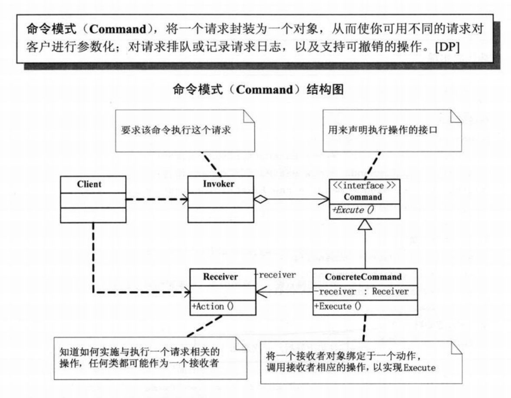

## **命令模式**

* 命令模式（Command Pattern）是一种数据驱动的设计模式，
它属于行为型模式。请求以命令的形式包裹在对象中，
并传给调用对象。调用对象寻找可以处理该命令的合适的对象，
并把该命令传给相应的对象，该对象执行命令。

命令模式的意图是将一个请求封装成一个对象，
从而使您可以用不同的请求对客户进行参数化。

命令模式主要解决的问题是在软件系统中，
行为请求者与行为实现者通常是一种紧耦合的关系，
但某些场合，比如需要对行为进行记录、撤销或重做、
事务等处理时，这种无法抵御变化的紧耦合的设计就不太合适。

在某些场合，比如要对行为进行"记录、撤销/重做、事务"等处理，
这种无法抵御变化的紧耦合是不合适的。在这种情况下，
如何将"行为请求者"与"行为实现者"解耦？将一组行为抽象为对象，
可以实现二者之间的松耦合，这是命令模式的使用场景。

系统需要支持命令的撤销(Undo)操作和恢复(Redo)操作，
也可以考虑使用命令模式

命令模式的实现过程通过调用者调用接受者执行命令，
顺序：调用者→接受者→命令。