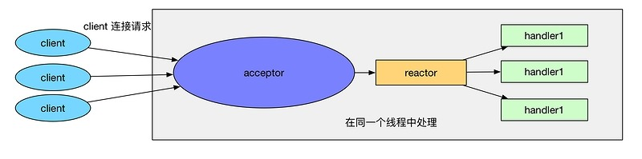
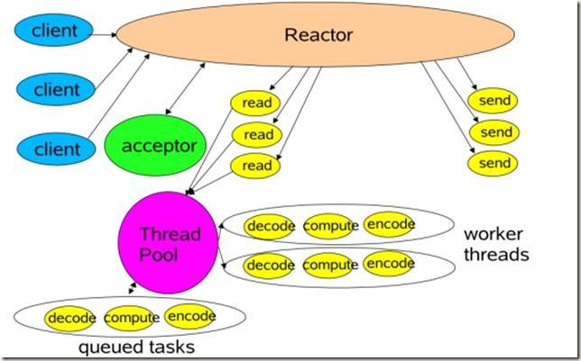
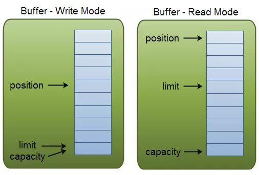
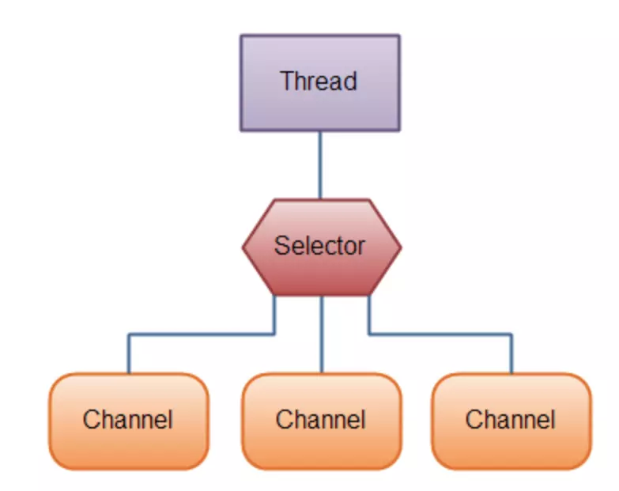
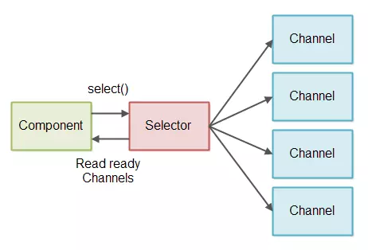

## Netty---Reactor模型---NIO---零拷贝---IO多路复用

###Netty简介
    一款基于NIO的网络通信框架，可以实现多种协议传输
    他运用了基于事件驱动的reactor模型---展开3种Reactor模型
    
####Reactor
* 最最原始的网络编程思路就是服务器用一个while循环，不断监听端口是否有新的套接字连接，如果有，那么就调用一个处理函数处理，类似：
```
while(true){

    socket = accept();

    handle(socket)

}
```
* 这种方法的最大问题是无法并发，效率太低，如果当前的请求没有处理完，那么后面的请求只能被阻塞，服务器的吞吐量太低。
  之后，想到了使用多线程，也就是很经典的connection per thread，每一个连接用一个线程处理,
  那么可申请的线程数不就是最大连接数了么。
  
  资源要求太高，系统中创建线程是需要比较高的系统资源的，如果连接数太高，系统无法承受，而且，线程的反复创建-销毁也需要代价。
  
* 改进：采用基于事件驱动的设计，当有事件触发时，才会调用处理器进行数据处理。使用Reactor模式，对线程的数量进行控制，一个线程处理大量的事件。
* Java的NIO模式的Selector网络通讯，其实就是一个简单的Reactor模型。可以说是Reactor模型的朴素原型。

Java的NIO模式的Selector网络通讯，其实就是一个简单的Reactor模型。可以说是Reactor模型的朴素原型。
```java
static class Server
    {

        public static void testServer() throws IOException
        {

            // 1、获取Selector选择器
            Selector selector = Selector.open();

            // 2、获取通道
            ServerSocketChannel serverSocketChannel = ServerSocketChannel.open();
            // 3.设置为非阻塞
            serverSocketChannel.configureBlocking(false);
            // 4、绑定连接
            serverSocketChannel.bind(new InetSocketAddress(SystemConfig.SOCKET_SERVER_PORT));

            // 5、将通道注册到选择器上,并注册的操作为：“接收”操作
            serverSocketChannel.register(selector, SelectionKey.OP_ACCEPT);

            // 6、采用轮询的方式，查询获取“准备就绪”的注册过的操作
            while (selector.select() > 0)
            {
                // 7、获取当前选择器中所有注册的选择键（“已经准备就绪的操作”）
                Iterator<SelectionKey> selectedKeys = selector.selectedKeys().iterator();
                while (selectedKeys.hasNext())
                {
                    // 8、获取“准备就绪”的时间
                    SelectionKey selectedKey = selectedKeys.next();

                    // 9、判断key是具体的什么事件
                    if (selectedKey.isAcceptable())
                    {
                        // 10、若接受的事件是“接收就绪” 操作,就获取客户端连接
                        SocketChannel socketChannel = serverSocketChannel.accept();
                        // 11、切换为非阻塞模式
                        socketChannel.configureBlocking(false);
                        // 12、将该通道注册到selector选择器上
                        socketChannel.register(selector, SelectionKey.OP_READ);
                    }
                    else if (selectedKey.isReadable())
                    {
                        // 13、获取该选择器上的“读就绪”状态的通道
                        SocketChannel socketChannel = (SocketChannel) selectedKey.channel();

                        // 14、读取数据
                        ByteBuffer byteBuffer = ByteBuffer.allocate(1024);
                        int length = 0;
                        while ((length = socketChannel.read(byteBuffer)) != -1)
                        {
                            byteBuffer.flip();
                            System.out.println(new String(byteBuffer.array(), 0, length));
                            byteBuffer.clear();
                        }
                        socketChannel.close();
                    }

                    // 15、移除选择键
                    selectedKeys.remove();
                }
            }

            // 7、关闭连接
            serverSocketChannel.close();
        }

        public static void main(String[] args) throws IOException
        {
            testServer();
        }
    }
```

* 实际上的Reactor模式，是基于Java NIO的，在他的基础上，抽象出来两个组件——Reactor和Handler两个组件：

1. Reactor：负责响应IO事件，当检测到一个新的事件，将其发送给相应的Handler去处理；新的事件包含连接建立就绪、读就绪、写就绪等。

2. Handler:将自身（handler）与事件绑定，负责事件的处理，完成channel的读入，完成处理业务逻辑后，负责将结果写出channel。

* 单线程Reactor

缺点就是如果某一个handler堵塞会导致整体都堵塞了。单线程模型不能充分利用多核资源，所以实际使用的不多。
* 基于线程池的改进 多线程Reactor

可以看到reactor只负责将客户端的请求事件分发给其他handler处理，多线程进行业务处理

####**优点**
1）响应快，不必为单个同步时间所阻塞，虽然Reactor本身依然是同步的；

2）编程相对简单，可以最大程度的避免复杂的多线程及同步问题，并且避免了多线程/进程的切换开销；

3）可扩展性，可以方便的通过增加Reactor实例个数来充分利用CPU资源；

4）可复用性，reactor框架本身与具体事件处理逻辑无关，具有很高的复用性；

###NIO(non-blocking IO)
* IO与NIO的区别 前者面向流，阻塞；后者面向缓冲，面向块的，是非阻塞的
* NIO核心API Channel, Buffer, Selector

**通道Channel**
```
NIO的通道类似于流，但有些区别如下：

1. 通道可以同时进行读写，而流只能读或者只能写

2. 通道可以实现异步读写数据

3. 通道可以从缓冲读数据，也可以写数据到缓冲: 
```
**缓存Buffer**

缓冲区本质上是一个可以写入数据的内存块，然后可以再次读取，该对象提供了一组方法，可以更轻松地使用内存块，使用缓冲区读取和写入数据通常遵循以下四个步骤：
```
1. 写数据到缓冲区；

2. 调用buffer.flip()方法；(写完后将缓存字节数组的指针指向数组下标0，表示可以开始读取了～)

3. 从缓冲区中读取数据；

4. 调用buffer.clear()或buffer.compat()方法；
```

当向buffer写入数据时，buffer会记录下写了多少数据，一旦要读取数据，需要通过flip()方法将Buffer从写模式切换到读模式，在读模式下可以读取之前写入到buffer的所有数据，一旦读完了所有的数据，就需要清空缓冲区，让它可以再次被写入。

**Buffer在与Channel交互时，需要一些标志:**

* buffer的大小/容量 - Capacity
* 作为一个内存块，Buffer有一个固定的大小值，用参数capacity表示。
* 当前读/写的位置 - Position​
* 当写数据到缓冲时，position表示当前待写入的位置，position最大可为capacity – 1；当从缓冲读取数据时，position表示从当前位置读取。
* 信息末尾的位置 - limit

在写模式下，缓冲区的limit表示你最多能往Buffer里写多少数据； 写模式下，limit等于Buffer的capacity，意味着你还能从缓冲区获取多少数据。

下图展示了buffer中三个关键属性capacity，position以及limit在读写模式中的说明：


**链接：https://www.jianshu.com/p/362b365e1bcc
来源：简书**

**缓冲区常用的操作**

* 向缓冲区写数据：

1. 从Channel写到Buffer；

2. 通过Buffer的put方法写到Buffer中；

* 从缓冲区读取数据：

1. 从Buffer中读取数据到Channel；

2. 通过Buffer的get方法从Buffer中读取数据；

* flip方法：

     将Buffer从写模式切换到读模式，将position值重置为0，limit的值设置为之前position的值；

* clear方法 vs compact方法：

     clear方法清空缓冲区；compact方法只会清空已读取的数据，而还未读取的数据继续保存在Buffer中；

**Selector**

一个组件，可以检测多个NIO channel，看看读或者写事件是否就绪。

多个Channel以事件的方式可以注册到同一个Selector，从而达到用一个线程处理多个请求成为可能。




###零拷贝 mmap sendFile

零拷贝这三个字，一直是服务器网络编程的关键字，任何性能优化都离不开。在 Java 程序员的世界，常用的零拷贝有 mmap 和 sendFile。
还是放上链接吧

* mmap内存映射，小数据。从内核拷贝到socket缓冲区     
* sendFile DMA直接存储器

**[零拷贝](https://www.jianshu.com/p/275602182f39)**

###IO多路复用
select poll epoll

**io多路复用(偶发性)有监听性质**

* fd_set：为一个存放文件描述符的信息的结构体，可以通过下面的宏进行设置。
```c++
void FD_ZERO(fd_set *fdset);
//清空集合
void FD_SET(int fd, fd_set *fdset);
//将一个给定的文件描述符加入集合之中
void FD_CLR(int fd, fd_set *fdset);
//将一个给定的文件描述符从集合中删除
int FD_ISSET(int fd, fd_set *fdset);
// 检查集合中指定的文件描述符是否可以读写
```
* poll本质上和select没有区别，它将用户传入的数组拷贝到内核空间，然后查询每个fd对应的设备状态， 但是它没有最大连接数的限制，原因是它是基于链表来存储的.
```
select    fd_set        fd_zero&fd_set     fd_isset(all)
poll     xpollin收      xpollout发          clientfds[all].reve
epoll     x              x                 双队列
```
* epoll的优点：
  
  1. 没有最大并发连接的限制，能打开的FD的上限远大于1024（1G的内存上能监听约10万个端口）；
  2. 效率提升，不是轮询的方式，不会随着FD数目的增加效率下降。只有活跃可用的FD才会调用callback函数；
  即Epoll最大的优点就在于它只管你“活跃”的连接，而跟连接总数无关，因此在实际的网络环境中，Epoll的效率就会远远高于select和poll。
  
  3.  内存拷贝，利用mmap()文件映射内存加速与内核空间的消息传递；即epoll使用mmap减少复制开销。
  
### Netty
熟悉了以上的内容，netty就更容易理解了。

关键词
* NIO
* Reactor
* 零拷贝，Netty自己封了ByteBuf，读写操作使用堆外的直接内存进行socket读写。传统的堆内存会造成多次拷贝。
* Netty 的文件传输采用了 transferTo 方法，它可以直接将文件缓冲区的数据发送到目标 Channel，避免了传统通过循环 write 方式导致的内存拷贝问题。
* 灵活性，提供了接口可以根据自己的需要实现业务，根据自己的需要选择通信协议
* 高性能序列化，支持protobuf等
* 内存池设计：申请的内存可以重用，主要指直接内存。内部实现是用一颗二叉查找树管理内存分配情况。

关键组件
* Channel：Netty 网络操作抽象类，它除了包括基本的 I/O 操作，如 bind、connect、read、write 等。
* EventLoop：主要是配合 Channel 处理 I/O 操作，用来处理连接的生命周期中所发生的事情。
* ChannelFuture：Netty 框架中所有的 I/O 操作都为异步的，因此我们需要 ChannelFuture 的 addListener()注册一个 ChannelFutureListener 监听事件，当操作执行成功或者失败时，监听就会自动触发返回结果。
* ChannelHandler：充当了所有处理入站和出站数据的逻辑容器。ChannelHandler 主要用来处理各种事件，这里的事件很广泛，比如可以是连接、数据接收、异常、数据转换等。
* ChannelPipeline：为 ChannelHandler 链提供了容器，当 channel 创建时，就会被自动分配到它专属的 ChannelPipeline，这个关联是永久性的。
  
