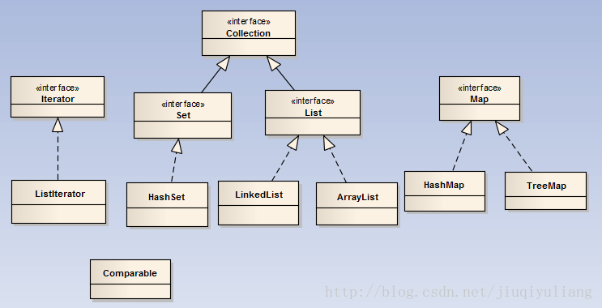

### **1 一般情况下，以下哪个选项不是关系数据模型与对象模型之间匹配关系？**
* 表对应类，记录对应对象，表的字段对应类的属性

### **2 以下代码输出结果是**
```
public class Test {
    public static void main(String args[]) {
    int x = -5;
    int y = -12;
    System.out.println(y % x);
    }
}
取模运算，结果的符号和被除数符号一致    切记切记
```

### **3 设有下面两个赋值语句：**
`  a = Integer.parseInt("1024");`

`  b = Integer.valueOf("1024").intValue();`
  * intValue()是把Integer对象类型变成int的基础数据类型； 
  * parseInt()是把String 变成int的基础数据类型； 
  * valueOf()是把String 转化成Integer对象类型；
  
### **4 Math**
 * floor: 求小于参数的最大整数。返回double类型-----n. 地板，地面
         例如：Math.floor(-4.2) = -5.0
-----------------------------------------------------------
 * ceil:   求大于参数的最小整数。返回double类型-----vt. 装天花板；
         例如：Math.ceil(5.6) = 6.0
-----------------------------------------------------------
 * round: 对小数进行四舍五入后的结果。返回int类型
         例如：Math.round(-4.6) = -5
  
### **5 以下代码执行结果为**
```
public class Test {
    public static void main(String args[]) {
    int i = -5;
    i =  ++(i++);
    System.out.println(i);
    }
}
```
    i =  ++(i++); 编译不过
    
### **6 java8中，下面哪个类用到了解决哈希冲突的开放定址法**
* ThreadLocalMap中使用开放地址法来处理散列冲突，而HashMap中使用的是分离链表法。
* 之所以采用不同的方式主要是因为：在ThreadLocalMap中的散列值分散得十分均匀，很少会出现冲突。并且ThreadLocalMap经常需要清除无用的对象，使用纯数组更加方便。

### **7 Java中的关键字有哪些**

* 48个关键字：abstract、assert、boolean、break、byte、case、catch、char、class、continue、default、do、double、else、enum、extends、final、finally、float、for、if、implements、import、int、interface、instanceof、long、native、new、package、private、protected、public、return、short、static、strictfp、super、switch、synchronized、this、throw、throws、transient、try、void、volatile、while。
* 2个保留字（现在没用以后可能用到作为关键字）：goto、const。
* 3个特殊直接量：true、false、null。 

### **8**
* 环境变量可在编译source code时指定
* javac一次可同时编译数个Java源文件
* javac.exe能指定编译结果要置于哪个目录（directory）

### **9 关于equals**
* equals()相等的两个对象他们的hashCode()肯定相等，也就是用equals()对比是绝对可靠的。

* hashCode()相等的两个对象他们的equal()不一定相等，也就是hashCode()不是绝对可靠的。

* 所有对于需要大量并且快速的对比的话如果都用equals()去做显然效率太低
* 解决方式是，每当需要对比的时候，首先用hashCode()去对比，
* 如果hashCode()不一样，则表示这两个对象肯定不相等（也就是不必再用equal()去再对比了）,
* 如果hashCode()相同，此时再对比他们的equals()，如果equals()也相同，则表示这两个对象是真的相同了
* 这样既能大大提高了效率也保证了对比的绝对正确性！

### **10 重写(override)**
 * 方法的重写（override）两同两小一大原则：
 * 方法名相同，参数类型相同
 * 子类返回类型小于等于父类方法返回类型，
 * 子类抛出异常小于等于父类方法抛出异常，
 * 子类访问权限大于等于父类方法访问权限。
  
### **11 collection**
 
 
### **12 ThreadLocal**
* ThreadLocal类用于创建一个线程本地变量
* 在Thread中有一个成员变量ThreadLocals，该变量的类型是ThreadLocalMap,也就是一个Map，它的键是threadLocal，值为就是变量的副本。通过ThreadLocal的get()方法可以获取该线程变量的本地副本，在get方法之前要先set,否则就要重写initialValue()方法。
* ThreadLocal的使用场景：
* 数据库连接：在多线程中，如果使用懒汉式的单例模式创建Connection对象，由于该对象是共享的，那么必须要使用同步方法保证线程安全，这样当一个线程在连接数据库时，那么另外一个线程只能等待。这样就造成性能降低。如果改为哪里要连接数据库就来进行连接，那么就会频繁的对数据库进行连接，性能还是不高。这时使用ThreadLocal就可以既可以保证线程安全又可以让性能不会太低。但是ThreadLocal的缺点时占用了较多的空间。

### **13 Exception** 
* A  所有的Java异常和错误的基类都是java.lang.Exception, 包括java.lang.RuntimeException
* B  通过try … catch … finally语句，finally中的语句部分无论发生什么异常都会得到执行
* C  java中所有的数据都是对象
* D  Java通过垃圾回收回收不再引用的变量，垃圾回收时对象的finallize方法一定会得到执行
* E  Java是跨平台的语言，无论通过哪个版本的Java编写的程序都能在所有的Java运行平台中运行
* F  Java通过synchronized进行访问的同步，synchronized作用非静态成员方法和静态成员方法上同步的目标是不同的
 
 
 ```
答案 B F
A、java异常和错误的基类Throwable,包括Exception和Error
B、try...catch...finally finally不管什么异常都会执行
C、java是面向对象的，不是所有的都是对象，基本数据类型就不是对象，所以才会有封装类的；
D、如果是等待清理队列中如果又被调用，则不会执行finallize方法
E、JAVA跨平台性    低版本不兼容高版本
F、synchronized实现方式：三种 1，修饰实例中的方法   2，修饰静态方法    3，修饰代码块
```
* A 异常的继承结构:基类为 Throwable,Error 和 Exception 实现 Throwable,RuntimeException 和 IOException 等继承 Exception
* B 非 RuntimeException 一般是外部错误(不考虑Error的情况下),其必须在当前类被 try{}catch 语句块所捕获
* C Error 类体系描述了 Java 运行系统中的内部错误以及资源耗尽的情形,Error 不需要捕捉
* D RuntimeException 体系包括错误的类型转换、数组越界访问和试图访问空指针等等,必须 被 try{}catch 语句块所捕获
 
 
`答案 A B C` 

### **14 基本类型**
```
A long test=012
B float f=-412
C int other =(int)true
D double d=0x12345678
E byte b=128

答案 A B D
解析:
* A和B中long和float，正常定义需要加l和f，但是long和float属于基本类型，会进行转化，所以不会报出异常。AB正确
* boolean类型不能和任何类型进行转换，会报出类型异常错误。所以C错。
* E: byte的取值范围是-128—127。报出异常： cannot convert from int to byte
```

* Java中的四类八种基本数据类型
  1. 整数类型  byte short int long  （int是整形，也属于整数类型）
  2. 浮点型  float double
  3. 逻辑型    boolean(它只有两个值可取true false)
  4. 字符型  char string
  
### **15 类加载**
* A. 默认情况下，Java应用启动过程涉及三个ClassLoader: Boostrap, Extension, System
* B. 一般的情况不同ClassLoader装载的类是不相同的，但接口类例外，对于同一接口所有类装载器装载所获得的类是相同的
* C. 类装载器需要保证类装载过程的线程安全
* D. ClassLoader的loadClass在装载一个类时，如果该类不存在它将返回null
* E. ClassLoader的父子结构中，默认装载采用了父优先
* F. 所有ClassLoader装载的类都来自CLASSPATH环境指定的路径
```
A、java中类的加载有5个过程，加载、验证、准备、解析、初始化；这便是类加载的5个过程，而类加载器的任务是根据一个类的全限定名来读取此类的二进制字节流到JVM中，然后转换为一个与目标类对应的java.lang.Class对象实例，
   在虚拟机提供了3种类加载器，
    引导（Bootstrap）类加载器
    扩展（Extension）类加载器
    系统（System）类加载器（也称应用类加载器）。A正确
B、一个类，由不同的类加载器实例加载的话，会在方法区产生两个不同的类，彼此不可见，并且在堆中生成不同Class实例。所以B前面部分是正确的，后面接口的部分真的没有尝试过，等一个大佬的讲解吧；
C、类加载器是肯定要保证线程安全的；C正确
D、装载一个不存在的类的时候，因为采用的双亲加载模式，所以强制加载会直接报错，D错误
java.lang.SecurityException: Prohibited package name: java.lang
E、双亲委派模式是在Java 1.2后引入的，其工作原理的是，如果一个类加载器收到了类加载请求，它并不会自己先去加载，而是把这个请求委托给父类的加载器去执行，如果父类加载器还存在其父类加载器，则进一步向上委托，依次递归，请求最终将到达顶层的启动类加载器，如果父类加载器可以完成类加载任务，就成功返回，倘若父类加载器无法完成此加载任务，子加载器才会尝试自己去加载，这就是双亲委派模式，即每个儿子都很懒，每次有活就丢给父亲去干，直到父亲说这件事我也干不了时，儿子自己想办法去完成，所以默认是父装载，E正确
F、自定义类加载器实现 继承ClassLoader后重写了findClass方法加载指定路径上的class，F错误
```
### **16 String**
```
String s = new String("xyz");创建了几个StringObject？
```
* 如果常量池中存在“xyz”就只会创建一个对象，如果没有就会创建两个！
