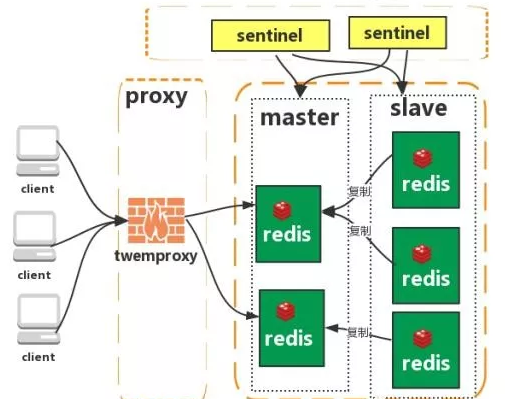

## Redis
###基本数据类型
* String字符串：
  
  格式: set key value
  
  string类型是二进制安全的。意思是redis的string可以包含任何数据。比如jpg图片或者序列化的对象 。
  
  string类型是Redis最基本的数据类型，一个键最大能存储512MB。

* Hash（哈希）
  
  格式: hmset name  key1 value1 key2 value2
  
  Redis hash 是一个键值(key=>value)对集合。
  
  Redis hash是一个string类型的field和value的映射表，hash特别适合用于存储对象。
  
* List（列表）
  
  Redis 列表是简单的字符串列表，按照插入顺序排序。你可以添加一个元素到列表的头部（左边）或者尾部（右边）
  
* Set（集合）
  
  格式: sadd  name  value
  
  Redis的Set是string类型的无序集合。
  
  集合是通过哈希表实现的，所以添加，删除，查找的复杂度都是O(1)。
  
* zset(sorted set：有序集合)
  
  格式: zadd  name score value
  
  Redis zset 和 set 一样也是string类型元素的集合,且不允许重复的成员。
  
  不同的是每个元素都会关联一个double类型的分数。redis正是通过分数来为集合中的成员进行从小到大的排序。
  
  zset的成员是唯一的,但分数(score)却可以重复。
  
###持久化
* RDB 是Redis DataBase缩写

    功能核心函数rdbSave(生成RDB文件)和rdbLoad（从文件加载内存）两个函数

* AOF: 是Append-only file缩写
    
    每当执行服务器(定时)任务或者函数时flushAppendOnlyFile 函数都会被调用， 这个函数执行以下两个工作
    
    aof写入保存：
    
    WRITE：根据条件，将 aof_buf 中的缓存写入到 AOF 文件
    
    SAVE：根据条件，调用 fsync 或 fdatasync 函数，将 AOF 文件保存到磁盘中

###redis通讯协议(RESP )
* RESP 是redis客户端和服务端之前使用的一种通讯协议；
* RESP 的特点：实现简单、快速解析、可读性好

###Redis 有哪些架构模式？
* 单机版
    
        特点：简单
        
        问题：
        
        1、内存容量有限 2、处理能力有限 3、无法高可用。
     
* 主从复制
 
    Redis 的复制（replication）功能允许用户根据一个 Redis 服务器来创建任意多个该服务器的复制品，其中被复制的服务器为主服务器（master），而通过复制创建出来的服务器复制品则为从服务器（slave）。 只要主从服务器之间的网络连接正常，主从服务器两者会具有相同的数据，主服务器就会一直将发生在自己身上的数据更新同步 给从服务器，从而一直保证主从服务器的数据相同。

        特点：
    
        1、master/slave 角色
    
        2、master/slave 数据相同
    
        3、降低 master 读压力在转交从库
    
        问题：
    
        无法保证高可用
    
    没有解决 master 写的压力
    
* **哨兵模式**
 
Redis sentinel 是一个分布式系统中监控 redis 主从服务器，并在主服务器下线时自动进行故障转移。其中三个特性：

    * 监控（Monitoring）：    Sentinel  会不断地检查你的主服务器和从服务器是否运作正常。
    * 提醒（Notification）： 当被监控的某个 Redis 服务器出现问题时， Sentinel 可以通过 API 向管理员或者其他应用程序发送通知。

自动故障迁移（Automatic failover）： 当一个主服务器不能正常工作时， Sentinel 会开始一次自动故障迁移操作。

        特点：

        1、保证高可用

        2、监控各个节点

        3、自动故障迁移

        缺点：主从模式，切换需要时间丢数据

        没有解决 master 写的压力
        
* 集群(Proxy)
 
 Twemproxy 是一个 Twitter 开源的一个 redis 和 memcache 快速/轻量级代理服务器； 
 Twemproxy 是一个快速的单线程代理程序，支持 Memcached ASCII 协议和 redis 协议。
 
        特点：
        1、多种 hash 算法：MD5、CRC16、CRC32、CRC32a、hsieh、murmur、Jenkins 
 
        2、支持失败节点自动删除
 
        3、后端 Sharding 分片逻辑对业务透明，业务方的读写方式和操作单个 Redis 一致
 
        缺点：
        增加了新的 proxy，需要维护其高可用。
 
        failover 逻辑需要自己实现，其本身不能支持故障的自动转移可扩展性差，进行扩缩容都需要手动干预
* 集群(直连式)
 
 从redis 3.0之后版本支持redis-cluster集群，Redis-Cluster采用无中心结构，每个节点保存数据和整个集群状态,每个节点都和其他所有节点连接。
 
        特点：
 
        1、无中心架构（不存在哪个节点影响性能瓶颈），少了 proxy 层。
 
        2、数据按照 slot 存储分布在多个节点，节点间数据共享，可动态调整数据分布。
 
        3、可扩展性，可线性扩展到 1000 个节点，节点可动态添加或删除。
 
        4、高可用性，部分节点不可用时，集群仍可用。通过增加 Slave 做备份数据副本
 
        5、实现故障自动 failover，节点之间通过 gossip 协议交换状态信息，用投票机制完成 Slave到 Master 的角色提升。
 
        缺点：
 
        1、资源隔离性较差，容易出现相互影响的情况。
 
        2、数据通过异步复制,不保证数据的强一致性
        
###一致性hash(负载均衡)
 **哈希环  映射**
 1. 首先计算已有ip地址的hash值(构成一个环)
 2. 顺时针从0(首个)开始，一直到最大的那个，在环上做映射
 3. 当用户在客户端进行请求的时候，首先根据hash(用户id)计算路由规则(hash值)根据hash值在hash环上的位置顺时针找距离最近的ip作为路由ip
 
 宕机： 只有之前被上一个机器处理的一部分用户的映射关系被破坏了，并且其负责处理的请求被顺时针下一个节点委托处理。
 新加结点：新增的服务器顺时针最近的服务器的一部分请求会被新增的服务器所替代。
 
 * 特性
    * 单调性(Monotonicity)，单调性是指如果已经有一些请求通过哈希分派到了相应的服务器进行处理，又有新的服务器加入到系统中时候，应保证原有的请求可以被映射到原有的或者新的服务器中去，而不会被映射到原来的其它服务器上去。 这个通过上面新增服务器ip5可以证明，新增ip5后，原来被ip1处理的user6现在还是被ip1处理，原来被ip1处理的user5现在被新增的ip5处理。
 
    * 分散性(Spread)：分布式环境中，客户端请求时候可能不知道所有服务器的存在，可能只知道其中一部分服务器，在客户端看来他看到的部分服务器会形成一个完整的hash环。如果多个客户端都把部分服务器作为一个完整hash环，那么可能会导致，同一个用户的请求被路由到不同的服务器进行处理。这种情况显然是应该避免的，因为它不能保证同一个用户的请求落到同一个服务器。所谓分散性是指上述情况发生的严重程度。好的哈希算法应尽量避免尽量降低分散性。 一致性hash具有很低的分散性
 
    * 平衡性(Balance)：平衡性也就是说负载均衡，是指客户端hash后的请求应该能够分散到不同的服务器上去。一致性hash可以做到每个服务器都进行处理请求，但是不能保证每个服务器处理的请求的数量大致相同
 
    作者：阿里加多
    链接：https://www.jianshu.com/p/e968c081f563
    来源：简书
    
 * 虚拟节点
        
        当服务器节点较少时，会出现hash倾斜问题，可以给真机增加虚拟节点，打在虚拟节点上的客户端请求由真机处理
    
        如果生成虚拟节点的算法不够好，也不能保证均衡。
    
        均匀一致性hash的目标是如果服务器有N台，客户端的hash值有M个，那么每个服务器应该处理大概M/N个用户的。也就是每台服务器负载尽量均衡
    
 * 在分布式系统中一致性hash起着不可忽略的地位，无论是分布式缓存，还是分布式Rpc框架的负载均衡策略都有所使用。
###**缓存击穿**

* 缓存击穿:是指缓存和数据库当中都没有数据，而用户不断发起请求，这种时候，用户可能是一个攻击者
这种攻击会导致，数据库连接暴增，直到数据库挂掉(针对一个key)
* 解决办法：给缓存中这个对象v设个null，查的时候返回

###**缓存雪崩**

* 缓存雪崩：是指缓存中数据量大批到达过期时间，此时，数据库查询这些数据的请求激增，引起数据库压力过大
           -----数据库挂掉(针对一堆key)
* 解决办法:1---给缓存中的数据，随机设置不同的过期时间(设置过期时间应在某个基数的基础上，随机增加一个较短的时间值)
          2---热点数据永不过期 (某些业务场景的高频次查询数据可以设置不过期，更新数据时同时更新缓存) 
          3---如果缓存数据库是分布式的情况，将热点数据均匀分布在不同的缓存数据库中
          

# 本周计划 
* 项目完善
* 项目 aop改造redis缓存
* 新的思路---kafka同步数据---定时向hadoop中存储数据---在另一个模块中做数据分析
