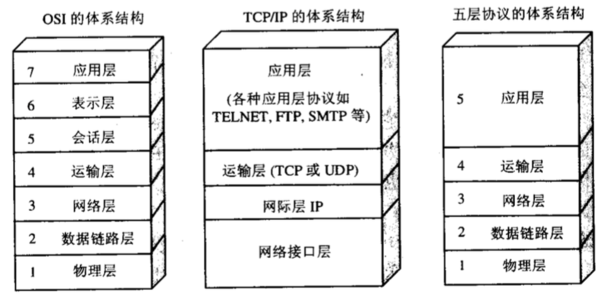
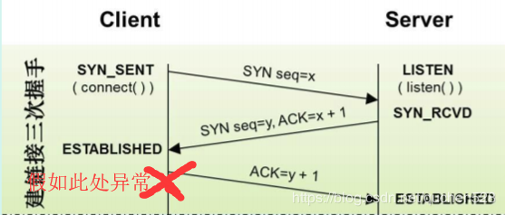
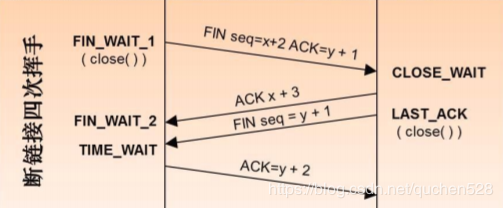

# TCP/UDP/HTTP
1. OSI七层协议模型、
2. TCP/IP四层模型、
3. 五层协议体系结构(OSI和TCP/IP的综合)

请求连接建立的一方向监听连接的一方发送SYNC请求和一个未知数x，监听方收到请求后，
向请求方发送ACK(x+1)表明收到请求，并发送SYNC和未知数y，请求方确认收到监听方发来的
ACK和SYNC后，再向监听方发送ACK(y+1)表明收到监听方发来请求，没有问题，连接建立

##一、TCP协议与HTTP协议异同点
1. TCP协议对应于传输层，而HTTP协议对应于应用层.
2. Http协议是建立在TCP协议基础之上的。当浏览器需要从服务器获取网页数据的时候，会发出一次Http请求。
Http会通过TCP建立起一个到服务器的连接通道，当本次请求需要的数据完毕后，Http会立即将TCP连接断开，这个过程是很短的。
3. 所以Http连接是一种无状态的短连接。所谓的无状态，是指浏览器每次向服务器发起请求的时候，不是通过一个连接，而是每次都建立一个新的连接。如果是一个连接的话，服务器进程中就能保持住这个连接并且在内存中记住一些信息状态。而每次请求结束后，连接就关闭，相关的内容就释放了，所以记不住任何状态，成为无状态连接。随着时间的推移，html页面变得复杂了，里面可能嵌入了很多图片，这时候每次访问图片都需要建立一次tcp连接就显得低效了。因此Keep-Alive被提出用来解决效率低的问题。从HTTP/1.1起，默认都开启了Keep-Alive，保持连接特性，简单地说，当一个网页打开完成后，客户端和服务器之间用于传输HTTP数据的TCP连接不会关闭，如果客户端再次访问这个服务器上的网页，会继续使用这一条已经建立的连接Keep-Alive不会永久保持连接，它有一个保持时间，可以在不同的服务器软件（如Apache）中设定这个时间。虽然这里使用TCP连接保持了一段时间，但是这个时间是有限范围的，到了时间点依然是会关闭的，所以我们还把其看做是每次连接完成后就会关闭。后来，通过Session, Cookie等相关技术，也能保持一些用户的状态。但是还是每次都使用一个连接，依然是无状态连接。

 
##二、为什么Http是无状态的短连接，而TCP是有状态的长连接？
##Http不是建立在TCP的基础上吗，为什么还能是短连接？
Http就是在每次请求完成后就把TCP连接关了，所以是短连接。
而我们直接通过Socket编程使用TCP协议的时候，
因为我们自己可以通过代码区控制什么时候打开连接什么时候关闭连接，
只要我们不通过代码把连接关闭，这个连接就会在客户端和服务端的进程中一直存在，相关状态数据会一直保存着。

##三、TCP如何保证可靠性？（已考）
1. 应用数据被分割成TCP认为最适合发送的数据块。这和UDP完全不同，应用程序产生的数据报长度将保持不变。(将数据截断为合理的长度)
2. 当TCP发出一个段后，它启动一个定时器，等待目的端确认收到这个报文段。如果不能及时收到一个确认，将重发这个报文段。 (超时重发)
3. 当TCP收到发自TCP连接另一端的数据，它将发送一个确认。这个确认不是立即发送，通常将推迟几分之一秒 。 (对于收到的请求，给出确认响应)(之所以推迟，可能是要对包做完整校验)
4. TCP将保持它首部和数据的检验和。这是一个端到端的检验和，目的是检测数据在传输过程中的任何变化。如果收到段的检验和有差错，TCP将丢弃这个报文段和不确认收到此报文段。 (校验出包有错，丢弃报文段，不给出响应，TCP发送数据端，超时时会重发数据)
5. 既然TCP报文段作为IP数据报来传输，而IP数据报的到达可能会失序，因此TCP报文段的到达也可能会失序。如果必要，TCP将对收到的数据进行重新排序，将收到的数据以正确的顺序交给应用层。(对失序数据进行重新排序，然后才交给应用层)
6. 既然IP数据报会发生重复，TCP的接收端必须丢弃重复的数据。(对于重复数据，能够丢弃重复数据)
7. TCP还能提供流量控制。TCP连接的每一方都有固定大小的缓冲空间。TCP的接收端只允许另一端发送接收端缓冲区所能接纳的数据。这将防止较快主机致使较慢主机的缓冲区溢出。(TCP可以进行流量控制，防止较快主机致使较慢主机的缓冲区溢出)TCP使用的流量控制协议是可变大小的滑动窗口协议。

## HTTP与HTTPS的区别
HTTPS协议可以理解为HTTP协议的升级，就是在HTTP的基础上增加了数据加密。
在数据进行传输之前，对数据进行加密，然后再发送到服务器。
这样，就算数据被第三者所截获，但是由于数据是加密的，所以你的个人信息是安全的。
这就是HTTP和HTTPS的最大区别。

## HTTP
###什么是HTTP 2.0
    HTTP/2（超文本传输协议第2版，最初命名为HTTP 2.0），是HTTP协议的的第二个主要版本，
    使用于万维网。HTTP/2是HTTP协议自1999年HTTP 1.1发布后的首个更新，主要基于SPDY协
    议（是Google开发的基于TCP的应用层协议，用以最小化网络延迟，提升网络速度，优化用户
    的网络使用体验）。

### 与HTTP 1.1相比，主要区别包括

* HTTP/2采用二进制格式而非文本格式
* HTTP/2是完全多路复用的，而非有序并阻塞的——只需一个连接即可实现并行
* 使用报头压缩，HTTP/2降低了开销
* HTTP/2让服务器可以将响应主动“推送”到客户端缓存中

### HTTP/2为什么是二进制？

*比起像HTTP/1.x这样的文本协议，二进制协议解析起来更高效、“线上”更紧凑，更重要的是错误更少。

### 为什么 HTTP/2 需要多路传输?

    HTTP/1.x 有个问题叫线端阻塞(head-of-line blocking), 它是指一个连接(connection)一次只提交一个请
    求的效率比较高, 多了就会变慢。 HTTP/1.1 试过用流水线(pipelining)来解决这个问题, 但是效果并不理
    想(数据量较大或者速度较慢的响应, 会阻碍排在他后面的请求). 此外, 由于网络媒介(intermediary )和服
    务器不能很好的支持流水线, 导致部署起来困难重重。而多路传输(Multiplexing)能很好的解决这些问题,
    因为它能同时处理多个消息的请求和响应; 甚至可以在传输过程中将一个消息跟另外一个掺杂在一起。
    所以客户端只需要一个连接就能加载一个页面。

### 消息头为什么需要压缩?

    假定一个页面有80个资源需要加载（这个数量对于今天的Web而言还是挺保守的）, 而每一次请求都有
    1400字节的消息头（着同样也并不少见，因为Cookie和引用等东西的存在）, 至少要7到8个来回去“在线
    ”获得这些消息头。这还不包括响应时间——那只是从客户端那里获取到它们所花的时间而已。这全都由
    于TCP的慢启动机制，它会基于对已知有多少个包，来确定还要来回去获取哪些包 – 这很明显的限制了
    最初的几个来回可以发送的数据包的数量。相比之下，即使是头部轻微的压缩也可以是让那些请求只需
    一个来回就能搞定——有时候甚至一个包就可以了。这种开销是可以被节省下来的，特别是当你考虑移
    动客户端应用的时候，即使是良好条件下，一般也会看到几百毫秒的来回延迟。

### 服务器推送的好处是什么？

    当浏览器请求一个网页时，服务器将会发回HTML，在服务器开始发送JavaScript、图片和CSS前，服务
    器需要等待浏览器解析HTML和发送所有内嵌资源的请求。服务器推送服务通过“推送”那些它认为客户端
    将会需要的内容到客户端的缓存中，以此来避免往返的延迟。